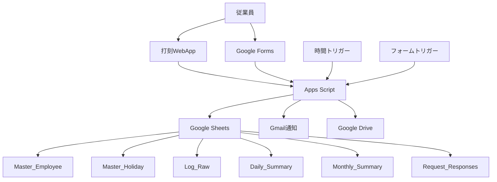

# 設計書

## 概要

本設計書は、Google Apps ScriptとGoogle スプレッドシートを基盤とした出勤管理システムのアーキテクチャと実装詳細を定義します。システムは50名以下の小規模組織向けに設計され、Googleの無料枠制限内で動作し、堅牢なエラーハンドリングと効率的なクォータ管理を実現します。

## アーキテクチャ

### システム全体構成



### レイヤー構成

1. **プレゼンテーション層**
   - 打刻WebApp（HTML/JavaScript）
   - Google Forms（申請用）

2. **ビジネスロジック層**
   - Apps Script（認証、計算、ワークフロー）
   - 自動トリガー処理

3. **データ層**
   - Google Sheets（6つのシート）
   - Google Drive（CSVエクスポート）

## コンポーネントと インターフェース

### 1. 認証・セキュリティコンポーネント

#### Authentication.gs
```javascript
// 主要関数
function authenticateUser()
function authenticateUserFromEvent(e)
function validateEmployeeAccess(email)
function getEmployeeInfo(email)
```

**責任:**
- 複数の認証方法によるユーザー識別
  - `Session.getActiveUser().getEmail()`（プライマリ）
  - `e.parameter.email`（WebAppイベントからの取得、セキュリティ検証必須）
  - フォールバック認証方法
- 従業員マスタとの照合
- アクセス権限の検証
- デプロイメント設定に応じた認証方法の自動選択

**セキュリティ検証手順:**
```javascript
// なりすまし攻撃防止のための認証検証
function authenticateUserFromEvent(e) {
  const providedEmail = e.parameter.email;
  
  // 1. ドメインホワイトリスト検証
  if (!isAllowedDomain(providedEmail)) {
    throw new Error('許可されていないドメインです');
  }
  
  // 2. Master_Employeeシートとの照合
  const employee = getEmployeeInfo(providedEmail);
  if (!employee) {
    throw new Error('従業員マスタに存在しません');
  }
  
  // 3. Session.getActiveUser()とのクロスチェック
  const activeUser = Session.getActiveUser().getEmail();
  if (providedEmail !== activeUser) {
    Logger.log(`なりすまし攻撃の可能性: ${providedEmail} vs ${activeUser}`);
    throw new Error('認証情報の不一致');
  }
  
  return employee;
}

// ドメインホワイトリスト検証
function isAllowedDomain(email) {
  const allowedDomains = ['company.com', 'trusted-partner.com'];
  const domain = email.split('@')[1];
  return allowedDomains.includes(domain);
}
```

### 2. 打刻処理コンポーネント

#### WebApp.gs
```javascript
// 主要関数
function doGet(e)
function doPost(e)
function recordTimeEntry(employeeId, action)
function validateTimeEntry(employeeId, action, date)
```

**責任:**
- 打刻WebAppのUI提供
- 打刻データの受付と検証
- 重複チェック・整合性チェック
- Log_Rawシートへの記録

### 3. 業務ロジックコンポーネント

#### BusinessLogic.gs
```javascript
// 主要関数
function calculateDailyWorkTime(employeeId, date)
function calculateOvertime(workTime, standardTime)
function applyBreakDeduction(workTime)
function checkHoliday(date)
function updateDailySummary(employeeId, date)
```

**責任:**
- 労働時間計算（実働、残業、深夜）
- 休憩時間の自動控除
- 祝日・休日判定
- 遅刻・早退の判定

### 4. 承認ワークフローコンポーネント

#### FormManager.gs
```javascript
// 主要関数
function onRequestSubmit(e)
function processApprovalRequest(requestData)
function batchApprovalNotifications()
function updateRequestStatus(requestId, status)
```

**責任:**
- フォーム申請の受付
- 承認者の特定
- 承認通知のバッチ処理
- ステータス更新の処理

### 5. 自動処理コンポーネント

#### Triggers.gs
```javascript
// 主要関数
function dailyJob()
function weeklyOvertimeJob()
function monthlyJob()
function onOpen()
```

**責任:**
- 日次サマリー更新（02:00）
- 週次残業アラート（月曜07:00）
- 月次レポート生成（1日02:30）
- 未退勤者通知

### 6. 通知・メール管理コンポーネント

#### MailManager.gs
```javascript
// 主要関数
function sendBatchNotification(recipients, subject, body)
function sendErrorAlert(error, context)
function sendOvertimeWarning(employees)
function sendMonthlyReport(csvLinks)
```

**責任:**
- バッチメール送信（クォータ節約）
- エラー通知
- 各種アラート送信
- レポート配信

### 7. ユーティリティコンポーネント

#### Utils.gs
```javascript
// 主要関数
function isHoliday(date)
function formatTime(minutes)
function getSheetData(sheetName, range)
function setSheetData(sheetName, range, values)
function exportToCsv(sheetName, fileName)
```

**責任:**
- 共通ユーティリティ関数
- データアクセス抽象化
- 日付・時間処理
- CSVエクスポート

## データモデル

### スプレッドシート設計

#### 1. Master_Employee
```
列A: 社員ID (文字列, 主キー)
列B: 氏名 (文字列)
列C: Gmail (文字列, 認証用)
列D: 所属 (文字列)
列E: 雇用区分 (文字列)
列F: 上司Gmail (文字列, 承認者特定用)
列G: 基準始業 (時刻)
列H: 基準終業 (時刻)
```

#### 2. Master_Holiday
```
列A: 日付 (日付型, 主キー)
列B: 名称 (文字列)
列C: 法定休日フラグ (ブール)
列D: 会社休日フラグ (ブール)
```

#### 3. Log_Raw（保護対象）
```
列A: タイムスタンプ (日時)
列B: 社員ID (文字列)
列C: 氏名 (文字列)
列D: Action (IN/OUT/BRK_IN/BRK_OUT)
列E: 端末IP (文字列)
列F: 備考 (文字列)
```

#### 4. Daily_Summary
```
列A: 日付 (日付型)
列B: 社員ID (文字列)
列C: 出勤時刻 (時刻)
列D: 退勤時刻 (時刻)
列E: 休憩時間 (分)
列F: 実働時間 (分)
列G: 残業時間 (分)
列H: 遅刻早退 (分)
列I: 承認状態 (文字列)
```

#### 5. Monthly_Summary
```
列A: 年月 (文字列, YYYY-MM)
列B: 社員ID (文字列)
列C: 勤務日数 (数値)
列D: 総労働時間 (分)
列E: 残業時間 (分)
列F: 有給日数 (数値)
列G: 備考 (文字列)
```

#### 6. Request_Responses
```
列A: タイムスタンプ (日時)
列B: 社員ID (文字列)
列C: 種別 (修正/残業/休暇)
列D: 詳細 (文字列)
列E: 希望値 (文字列)
列F: 承認者 (文字列)
列G: Status (Pending/Approved/Rejected, プルダウン)
```

### データアクセスパターン

#### バッチ処理最適化
```javascript
// 効率的なデータ読み書き
const data = sheet.getRange(1, 1, lastRow, lastCol).getValues();
// 処理...
sheet.getRange(1, 1, data.length, data[0].length).setValues(data);
```

#### 差分更新戦略
```javascript
// 更新対象の従業員のみ処理
const updatedEmployees = getUpdatedEmployees(date);
updatedEmployees.forEach(emp => updateDailySummary(emp.id, date));
```

## 個人情報保護対策

### PII（個人識別情報）フィールドの保護

#### 保護対象フィールド
- **氏名** (Master_Employee列B, Log_Raw列C)
- **Gmail** (Master_Employee列C, Log_Raw関連)
- **端末IP** (Log_Raw列E)
- **備考** (Log_Raw列F, Request_Responses列D)

#### データマスキング機能
```javascript
// PIIフィールドの共有定数定義
const PII_FIELDS = {
  NAME: 'name',
  EMAIL: 'email',
  GMAIL: 'gmail',
  IP: 'ip',
  REMARKS: 'remarks',
  REMARKS_JP: '備考'
};

// PIIフィールドのマスキング処理
function maskPiiData(data, fields) {
  const maskedData = {...data};
  fields.forEach(field => {
    if (field === PII_FIELDS.NAME) {
      maskedData[field] = maskName(data[field]);
    } else if (field === PII_FIELDS.EMAIL || field === PII_FIELDS.GMAIL) {
      maskedData[field] = maskEmail(data[field]);
    } else if (field === PII_FIELDS.IP) {
      maskedData[field] = maskIpAddress(data[field]);
    } else if (field === PII_FIELDS.REMARKS || field === PII_FIELDS.REMARKS_JP) {
      maskedData[field] = maskRemarks(data[field]);
    }
  });
  return maskedData;
}

// 氏名マスキング（例：山田太郎 → 山田***）
function maskName(name) {
  if (!name || name.length <= 2) return name;
  return name.substring(0, 2) + '***';
}

// メールアドレスマスキング（例：yamada@company.com → y***@company.com）
function maskEmail(email) {
  if (!email || !email.includes('@')) return email;
  const [local, domain] = email.split('@');
  return local.substring(0, 1) + '***@' + domain;
}

// IPアドレスマスキング（例：192.168.1.100 → 192.168.***.***）
function maskIpAddress(ip) {
  if (!ip) return ip;
  const parts = ip.split('.');
  if (parts.length === 4) {
    return parts[0] + '.' + parts[1] + '.***.***';
  }
  return ip;
}

// 備考マスキング（例：個人情報を含む備考 → ***）
function maskRemarks(remarks) {
  if (!remarks || remarks.trim() === '') return remarks;
  return '***';
}
```

#### アクセス制限
```javascript
// ログ出力時のPII保護
function logWithPiiProtection(level, message, data = null) {
  if (data && containsPii(data)) {
    const maskedData = maskPiiData(data, [
      PII_FIELDS.NAME, 
      PII_FIELDS.EMAIL, 
      PII_FIELDS.GMAIL, 
      PII_FIELDS.IP, 
      PII_FIELDS.REMARKS, 
      PII_FIELDS.REMARKS_JP
    ]);
    Logger.log(`[${level}] ${message}: ${JSON.stringify(maskedData)}`);
  } else {
    Logger.log(`[${level}] ${message}`);
  }
}

// PII含有チェック
function containsPii(data) {
  const piiFields = [
    PII_FIELDS.NAME, 
    PII_FIELDS.EMAIL, 
    PII_FIELDS.GMAIL, 
    PII_FIELDS.IP, 
    PII_FIELDS.REMARKS, 
    PII_FIELDS.REMARKS_JP
  ];
  return piiFields.some(field => data.hasOwnProperty(field) && data[field]);
}
```

### ログ保持期間の定義

#### ログ保持ポリシー
- **Log_Raw**: 3年間保持（労働基準法第109条準拠）
- **Daily_Summary**: 7年間保持（労働基準法第109条準拠）
- **Monthly_Summary**: 7年間保持（労働基準法第109条準拠）
- **Request_Responses**: 3年間保持（申請記録として）
- **Error_Log**: 1年間保持（システム運用記録）

#### 自動削除機能
```javascript
// データ保持期間の定義（日数）
const DATA_RETENTION_POLICY = {
  'Log_Raw': 3 * 365,           // 3年間保持（労働基準法第109条準拠）
  'Daily_Summary': 7 * 365,     // 7年間保持（労働基準法第109条準拠）
  'Monthly_Summary': 7 * 365,   // 7年間保持（労働基準法第109条準拠）
  'Request_Responses': 3 * 365, // 3年間保持（申請記録として）
  'Error_Log': 365              // 1年間保持（システム運用記録）
};

// 期限切れデータの自動削除
function cleanupExpiredData() {
  // 各シートの保持期間に基づいて期限切れデータを削除
  Object.entries(DATA_RETENTION_POLICY).forEach(([sheetName, retentionDays]) => {
    cleanupSheetData(sheetName, retentionDays);
  });
}

// シート別データ削除
function cleanupSheetData(sheetName, daysToKeep) {
  const sheet = SpreadsheetApp.getActiveSpreadsheet().getSheetByName(sheetName);
  if (!sheet) return;
  
  const data = sheet.getDataRange().getValues();
  const cutoffDate = new Date();
  cutoffDate.setDate(cutoffDate.getDate() - daysToKeep);
  
  const rowsToDelete = [];
  for (let i = data.length - 1; i >= 0; i--) {
    const rowDate = new Date(data[i][0]); // タイムスタンプ列
    if (rowDate < cutoffDate) {
      rowsToDelete.push(i + 1);
    }
  }
  
  // 行を削除（下から上に向かって削除）
  rowsToDelete.forEach(rowIndex => {
    sheet.deleteRow(rowIndex);
  });
  
  Logger.log(`${sheetName}: ${rowsToDelete.length}行を削除しました`);
}
```

### 退職者データ処理

#### 自動匿名化・削除手順
```javascript
// 退職者データの処理
function processRetiredEmployeeData(employeeId) {
  const employee = getEmployeeInfo(employeeId);
  if (!employee) return;
  
  // 1. 退職者マスターへの移動
  moveToRetiredMaster(employee);
  
  // 2. ログデータの匿名化
  anonymizeLogData(employeeId);
  
  // 3. サマリーデータの匿名化
  anonymizeSummaryData(employeeId);
  
  // 4. 申請データの匿名化
  anonymizeRequestData(employeeId);
  
  Logger.log(`退職者データ処理完了: ${employeeId}`);
}

// ログデータの匿名化（一括更新版）
function anonymizeLogData(employeeId) {
  const sheet = SpreadsheetApp.getActiveSpreadsheet().getSheetByName('Log_Raw');
  if (!sheet) return;
  
  const data = sheet.getDataRange().getValues();
  const lastRow = data.length;
  const lastCol = data[0].length;
  
  // メモリ上でデータを処理
  for (let i = 1; i < data.length; i++) {
    if (data[i][1] === employeeId) { // 社員ID列
      // 氏名を匿名化（列C、インデックス2）
      data[i][2] = '退職者***';
      // 備考をクリア（列F、インデックス5）
      data[i][5] = '';
    }
  }
  
  // 一括更新でAPI呼び出しを削減
  sheet.getRange(1, 1, lastRow, lastCol).setValues(data);
  
  Logger.log(`Log_Raw: 退職者データ匿名化完了 (${employeeId})`);
}

// サマリーデータの匿名化（一括更新版）
function anonymizeSummaryData(employeeId) {
  const sheets = ['Daily_Summary', 'Monthly_Summary'];
  
  sheets.forEach(sheetName => {
    const sheet = SpreadsheetApp.getActiveSpreadsheet().getSheetByName(sheetName);
    if (!sheet) return;
    
    const data = sheet.getDataRange().getValues();
    const lastRow = data.length;
    const lastCol = data[0].length;
    
    // メモリ上でデータを処理
    for (let i = 1; i < data.length; i++) {
      if (data[i][1] === employeeId) { // 社員ID列
        // 備考を匿名化（最後の列）
        data[i][lastCol - 1] = '退職者データ';
      }
    }
    
    // 一括更新でAPI呼び出しを削減
    sheet.getRange(1, 1, lastRow, lastCol).setValues(data);
    
    Logger.log(`${sheetName}: 退職者データ匿名化完了 (${employeeId})`);
  });
}

// 申請データの匿名化（一括更新版）
function anonymizeRequestData(employeeId) {
  const sheet = SpreadsheetApp.getActiveSpreadsheet().getSheetByName('Request_Responses');
  if (!sheet) return;
  
  const data = sheet.getDataRange().getValues();
  const lastRow = data.length;
  const lastCol = data[0].length;
  
  // メモリ上でデータを処理
  for (let i = 1; i < data.length; i++) {
    if (data[i][1] === employeeId) { // 社員ID列
      // 詳細を匿名化（列D、インデックス3）
      data[i][3] = '退職者データ';
      // 希望値をクリア（列E、インデックス4）
      data[i][4] = '';
    }
  }
  
  // 一括更新でAPI呼び出しを削減
  sheet.getRange(1, 1, lastRow, lastCol).setValues(data);
  
  Logger.log(`Request_Responses: 退職者データ匿名化完了 (${employeeId})`);
}
```

### 個人情報保護法準拠

#### 法的要件への対応
- **利用目的の明示**: 勤怠管理・給与計算・労務管理
- **適切な取得**: 必要最小限の個人情報のみ収集
- **安全管理措置**: アクセス制限・暗号化・ログ監視
- **委託先管理**: Google Apps Script環境での適切な管理
- **個人の権利保護**: 開示・訂正・利用停止・削除への対応

#### プライバシーポリシー要件
```javascript
// プライバシーポリシー確認機能
function checkPrivacyCompliance() {
  const compliance = {
    dataRetention: checkDataRetentionPolicy(),
    accessControl: checkAccessControl(),
    dataMasking: checkDataMasking(),
    auditLog: checkAuditLog()
  };
  
  return compliance;
}

// データ保持期間チェック
function checkDataRetentionPolicy() {
  const policies = {
    'Log_Raw': 3 * 365,
    'Daily_Summary': 7 * 365,
    'Monthly_Summary': 7 * 365,
    'Request_Responses': 3 * 365,
    'Error_Log': 365
  };
  
  return Object.keys(policies).map(sheetName => {
    const actualDays = getOldestDataAge(sheetName);
    return {
      sheet: sheetName,
      policy: policies[sheetName],
      actual: actualDays,
      compliant: actualDays <= policies[sheetName]
    };
  });
}

/**
 * 指定されたシートの最古のデータエントリの日数を取得する
 * @param {string} sheetName - 対象シート名
 * @returns {number} 最古のデータからの経過日数（日単位）
 * 
 * 実装方法:
 * - 各シートの日付列（通常は列A）から最古の日付を取得
 * - 現在日付との差分を日数で計算
 * - データが存在しない場合は0を返す
 */
function getOldestDataAge(sheetName) {
  try {
    const sheet = SpreadsheetApp.getActiveSpreadsheet().getSheetByName(sheetName);
    if (!sheet) {
      Logger.log(`シートが見つかりません: ${sheetName}`);
      return 0;
    }
    
    const lastRow = sheet.getLastRow();
    if (lastRow <= 1) { // ヘッダーのみまたはデータなし
      Logger.log(`データが存在しません: ${sheetName}`);
      return 0;
    }
    
    // 各シートの日付列の位置を定義
    const dateColumnMap = {
      'Log_Raw': 0,        // 列A: タイムスタンプ
      'Daily_Summary': 0,  // 列A: 日付
      'Monthly_Summary': 0, // 列A: 年月
      'Request_Responses': 0, // 列A: タイムスタンプ
      'Error_Log': 0       // 列A: タイムスタンプ
    };
    
    const dateColumnIndex = dateColumnMap[sheetName] || 0;
    
    // 最古のデータを取得（最後の行の日付）
    const oldestDateCell = sheet.getRange(lastRow, dateColumnIndex + 1);
    const oldestDate = oldestDateCell.getValue();
    
    if (!oldestDate || !(oldestDate instanceof Date)) {
      Logger.log(`有効な日付が見つかりません: ${sheetName}, 行: ${lastRow}`);
      return 0;
    }
    
    // 現在日付との差分を日数で計算
    const currentDate = new Date();
    const timeDiff = currentDate.getTime() - oldestDate.getTime();
    const daysDiff = Math.floor(timeDiff / (1000 * 3600 * 24));
    
    Logger.log(`${sheetName}: 最古データ日付 ${oldestDate}, 経過日数 ${daysDiff}日`);
    return daysDiff;
    
  } catch (error) {
    Logger.log(`getOldestDataAge エラー (${sheetName}): ${error.toString()}`);
    return 0; // エラー時は0を返す
  }
}
```

## エラーハンドリング

### エラー処理戦略

#### 1. 包括的try-catch実装
```javascript
function dailyJob() {
  try {
    // メイン処理
    updateDailySummaries();
    sendNotifications();
  } catch (error) {
    Logger.log('Daily job failed: ' + error.toString());
    MailManager.sendErrorAlert(error, 'dailyJob');
    throw error; // 再スロー for monitoring
  }
}
```

#### 2. エラー分類と対応

**システムエラー:**
- Apps Script実行時間超過
- クォータ制限到達
- シートアクセス権限エラー

**ビジネスロジックエラー:**
- データ整合性エラー
- 計算エラー
- 承認フローエラー

**外部サービスエラー:**
- Gmail送信エラー
- Drive書き込みエラー

#### 3. エラー通知システム
```javascript
function sendErrorAlert(error, context) {
  const subject = `[緊急] 出勤管理システムエラー: ${context}`;
  const body = `
エラー詳細: ${error.message}
発生時刻: ${new Date()}
コンテキスト: ${context}
スタックトレース: ${error.stack}
  `;
  GmailApp.sendEmail(ADMIN_EMAIL, subject, body);
}
```

### 復旧戦略

#### 1. 自動復旧機能
- 一時的なエラーに対する再試行機能
- 部分的な処理継続機能

#### 2. 手動復旧支援
- エラー状況の詳細ログ
- 復旧手順の文書化
- データ整合性チェック機能

## テスト戦略

### テスト構成

#### 1. 単体テスト
```javascript
// BusinessLogicTest.gs
function testCalculateWorkTime() {
  const result = calculateDailyWorkTime('EMP001', new Date('2024-01-15'));
  assertEquals(480, result.workMinutes); // 8時間
}
```

#### 2. 統合テスト
```javascript
// IntegrationTest.gs
function testEndToEndTimeEntry() {
  // 打刻 → 計算 → サマリー更新の一連の流れをテスト
}
```

#### 3. テストカバレッジ管理
```javascript
// Test.gs
function showTestCoverage() {
  const moduleInfo = {
    'BusinessLogic.gs': ['calculateWorkTime', 'applyBreakDeduction'],
    'Authentication.gs': ['authenticateUser', 'validateAccess']
  };
  // カバレッジレポート生成
}
```

### テスト実行戦略

#### 1. 開発時テスト
- 関数単位での単体テスト
- モックデータを使用した統合テスト

#### 2. デプロイ前テスト
- 本番データのコピーを使用したテスト
- パフォーマンステスト

#### 3. 本番監視
- 日次処理の成功/失敗監視
- エラーログの定期確認

## セキュリティ設計

### アクセス制御

#### 1. 認証方式
```javascript
function authenticateUser() {
  const userEmail = Session.getActiveUser().getEmail();
  const employee = getEmployeeByEmail(userEmail);
  if (!employee) {
    throw new Error('認証失敗: 従業員マスタに存在しません');
  }
  return employee;
}

// なりすまし攻撃防止のための強化認証
function authenticateUserFromEvent(e) {
  const providedEmail = e.parameter.email;
  
  // 1. ドメインホワイトリスト検証
  if (!isAllowedDomain(providedEmail)) {
    Logger.log(`不正なドメインアクセス試行: ${providedEmail}`);
    throw new Error('許可されていないドメインです');
  }
  
  // 2. Master_Employeeシートとの照合
  const employee = getEmployeeInfo(providedEmail);
  if (!employee) {
    Logger.log(`存在しない従業員アクセス試行: ${providedEmail}`);
    throw new Error('従業員マスタに存在しません');
  }
  
  // 3. Session.getActiveUser()とのクロスチェック
  const activeUser = Session.getActiveUser().getEmail();
  if (providedEmail !== activeUser) {
    Logger.log(`なりすまし攻撃の可能性: ${providedEmail} vs ${activeUser}`);
    throw new Error('認証情報の不一致');
  }
  
  return employee;
}

// ドメインホワイトリスト検証
function isAllowedDomain(email) {
  const allowedDomains = ['company.com', 'trusted-partner.com'];
  const domain = email.split('@')[1];
  return allowedDomains.includes(domain);
}
```

#### 2. シート保護設定

**Log_Raw:** 完全保護（管理者のみアクセス）
**Summary系:** 全員読み取り専用
**Request_Responses:** 承認者は担当行のステータス列のみ編集可

#### 3. スクリプト権限管理
- 共有組織アカウントでの所有
- 編集権限は管理者のみ
- 実行権限は必要最小限

### データ保護

#### 1. 個人情報保護
- 必要最小限のデータ収集
- ログの定期アーカイブ
- 退職者データの適切な処理

#### 2. 監査ログ
```javascript
function logAccess(action, employeeId, details) {
  const logEntry = [
    new Date(),
    employeeId,
    action,
    details,
    Session.getActiveUser().getEmail()
  ];
  getSheet('Access_Log').appendRow(logEntry);
}
```

## パフォーマンス最適化

### クォータ管理戦略

#### 1. メール送信最適化
```javascript
// バッチ送信でクォータ節約
function sendBatchNotifications(notifications) {
  const groupedByRecipient = groupNotifications(notifications);
  Object.keys(groupedByRecipient).forEach(recipient => {
    const messages = groupedByRecipient[recipient];
    const combinedMessage = combineMessages(messages);
    GmailApp.sendEmail(recipient, combinedMessage.subject, combinedMessage.body);
  });
}
```

#### 2. 実行時間最適化
```javascript
// チャンク処理で実行時間制限回避
function processLargeDataset(data) {
  const CHUNK_SIZE = 100;
  const startTime = new Date(); // 実行開始時刻を記録
  
  for (let i = 0; i < data.length; i += CHUNK_SIZE) {
    const chunk = data.slice(i, i + CHUNK_SIZE);
    processChunk(chunk);
    
    // 実行時間チェック
    if (new Date() - startTime > MAX_EXECUTION_TIME) {
      scheduleNextExecution(i + CHUNK_SIZE);
      break;
    }
  }
}
```

#### 3. データアクセス最適化
```javascript
// 一括読み書きでAPI呼び出し削減
function optimizedDataUpdate(updates) {
  const sheet = getSheet('Daily_Summary');
  const range = sheet.getRange(1, 1, sheet.getLastRow(), sheet.getLastColumn());
  const values = range.getValues();
  
  // メモリ上で更新処理
  updates.forEach(update => {
    values[update.row][update.col] = update.value;
  });
  
  // 一括書き込み
  range.setValues(values);
}
```

### スケーラビリティ考慮

#### 1. データ量増加対応
- 月次アーカイブ機能
- 古いデータの別シート移動
- 検索範囲の最適化

#### 2. ユーザー数増加対応
- 部門別処理の並列化
- 処理優先度の設定
- 負荷分散の検討

## 運用・保守設計

### 監視機能

#### 1. システム稼働監視
```javascript
function healthCheck() {
  const checks = [
    checkSheetAccess(),
    checkTriggerStatus(),
    checkQuotaUsage()
  ];
  
  const failures = checks.filter(check => !check.success);
  if (failures.length > 0) {
    sendHealthAlert(failures);
  }
}
```

#### 2. データ整合性チェック
```javascript
function validateDataIntegrity() {
  const issues = [
    checkMissingClockOuts(),
    checkCalculationErrors(),
    checkApprovalConsistency()
  ];
  
  return issues.filter(issue => issue.severity === 'HIGH');
}
```

### バックアップ・復旧

#### 1. 自動バックアップ
```javascript
function createBackup() {
  const timestamp = Utilities.formatDate(new Date(), 'JST', 'yyyyMMdd_HHmmss');
  const backupName = `出勤管理_バックアップ_${timestamp}`;
  
  const originalFile = DriveApp.getFileById(SPREADSHEET_ID);
  const backup = originalFile.makeCopy(backupName);
  
  // バックアップフォルダに移動
  DriveApp.getFolderById(BACKUP_FOLDER_ID).addFile(backup);
}
```

#### 2. 復旧手順
- バックアップからの復元手順
- データ整合性の確認方法
- 段階的復旧プロセス